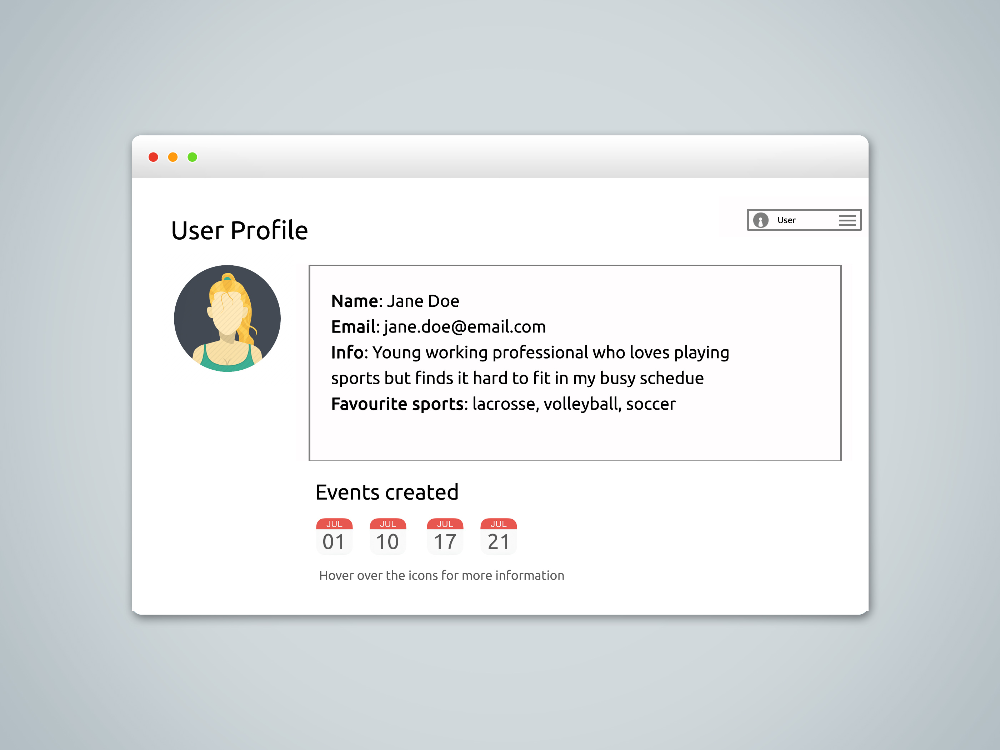

# CSC309 Project Proposal

## High Level Description 
>A paragraph or two describing the topic of your application. What is the overall purpose of your application? Who does it serve? Explain at a high level what users will be able to do using your application.

As we get older, it gets harder to commit to organized sporting leagues but we still want to participate in sports for fun. However, it can often be difficult to find enough people to organize a game. The purpose of our application is to help people find recreational, drop-in sporting events. 

Our web portal will allow users to organize and search for drop-in events based on sport, time and location. The targeted users will be anybody who is looking for a fun, inclusive yet low-commitment environment to partake in their favourite sports. Users can RSVP and leave comments to the event so the organizer knows who to expect. 

## User Interactions
>A detailed list of the user interactions with the application. How will you get data into your application? What are all the different things a user will do when they use your application?

- Profiling
    - Users can update their personal info and see profiles of other users 
- User authentication / authorization
    - Users need to register for an account and be signed in to search and RSVP for events 
- Search feature
    - Users will be able to search for events based on sport, date & time and/or location
- Data
    - User information
        - Required: name, email, username, password
        - Optional: other contact information, short biography, avatar
    - Event information 
        - Required: type, date/time, location
        - Optional: description, number of players required
- Views
    - Log-in/Sign-up 
    - Dashboard
    	- Activity stream of recent event postings
    - View user profile
    	- Message user (*tentative*)
    - Search
    - View event listing 
        - RSVP or leave a comment
    - Post a new event listing 
- Admin features
    - Add/update/delete users and their information
    - Can change password (but not see previous passwords!)
    - Initialize or remove any posts 

## Sketches
>Sketches of what the views will look like to the user. These do not have to be fancy polished drawings, or HTML mock-ups. They must be legible, but they could be scanned hand drawings.

Dashboard

    

View event listing

    

User profile

    

Create new event

    

